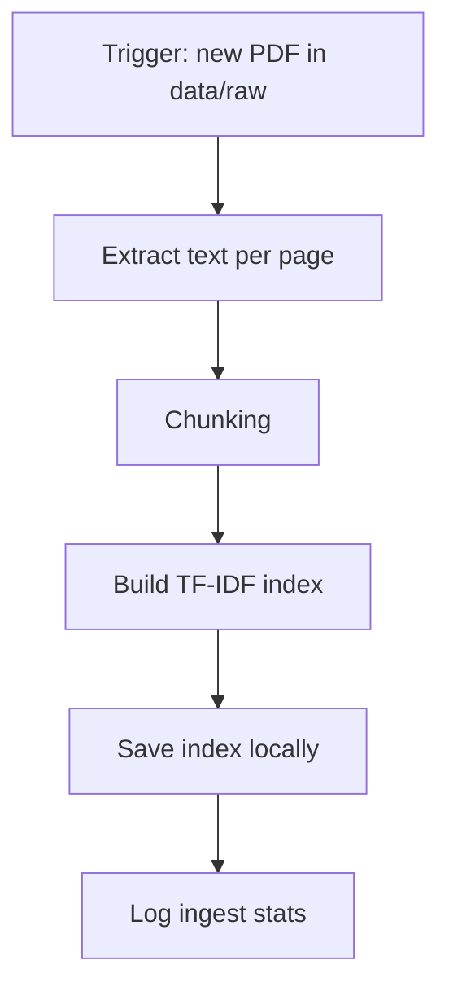
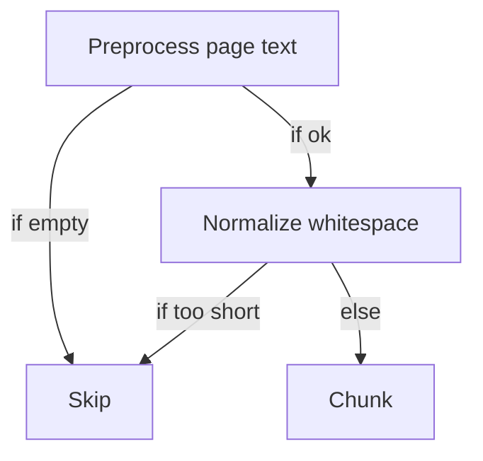
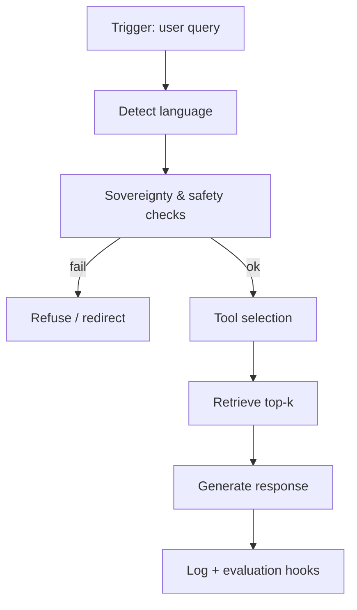

# Phase 1 — Design artifacts (Part B)

## 1) Global architecture (block diagram)

```mermaid
flowchart LR
  U[User (Arabic/French)] -->|query| API[API / UI]
  API -->|request| AG[Agent Controller]

  subgraph LocalData[Local Tunisian Heritage Data]
    PDF[Raw PDFs] --> PRE[Preprocess + Chunk]
    PRE --> IDX[Vector/Keyword Index]
  end

  AG -->|retrieve| RET[Retriever]
  RET -->|top-k chunks| AG

  AG -->|optional| TR[Translation Tool (local-first)]
  AG -->|optional| ONT[Ontology/Glossary Lookup]
  AG -->|guardrails| SAFE[Sovereignty + Safety Filter]

  SAFE --> GEN[Answer Generator (LLM local or minimal summarizer)]
  GEN --> API -->|answer| U

  AG --> LOG[Logging]
```

Main I/O examples:
- `raw PDFs -> cleaned chunks`
- `query -> top-k relevant chunks`
- `query + chunks -> grounded answer + citations`

## 2) Workflows

### 2.1 Ingestion workflow



Subworkflow (Preprocessing) with branches:


### 2.2 Query / agent workflow



Tool selection subworkflow (3 branches):
```mermaid
flowchart TD
  TS[Tool selection] -->|Arabic query| TR[Translate (offline/local)]
  TS -->|Heritage keywords| RET[Retrieve]
  TS -->|Non-heritage / unsafe| REF[Refuse]
```

## 3) Agent decision pseudocode + evaluation hooks

```text
function AGENT_LOOP(query):
  lang = DETECT_LANGUAGE(query)

  if NOT SOVEREIGNTY_OK():
    return REFUSE("sovereignty")

  if NOT SAFETY_OK(query):
    return REFUSE("safety")

  if lang == "ar":
    query2 = TRANSLATE_AR_TO_FR_OFFLINE(query)
  else:
    query2 = query

  (chunks, scores) = RETRIEVE_TOPK(query2)

  answer = GENERATE_ANSWER(query2, chunks)

  # Evaluation hooks (Phase 2)
  EVAL.after_generate.hallucination_risk = 1 - avg(scores)
  EVAL.after_tool_selection.foreign_tools_used = 0
  LOG(query, tools_used, scores, answer)

  return answer
```
